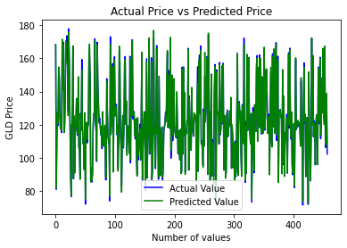

# 💰 Gold Price Prediction using Machine Learning 📈


[](https://colab.research.google.com/drive/1wLHsq3JnVIZL-IQK9653dht76qboi825?usp=sharing)

---

## 📌 Project Overview

This project implements a **Machine Learning Regression Model** to predict the price of Gold (GLD ETF) using financial market indicators.

Unlike classification problems, this is a **Regression Task** because:

- 🎯 The target variable (**GLD price**) is continuous.
- 📊 The goal is to estimate numerical values rather than categories.

The model uses **Random Forest Regressor**, an ensemble learning algorithm capable of modeling complex and nonlinear financial relationships.

---

## 📊 Dataset Information

The model is trained on a historical financial dataset containing:

- 📅 **Date**
- 📈 **SPX** – S&P 500 Index
- 🛢 **USO** – Crude Oil ETF
- 🥈 **SLV** – Silver ETF
- 💱 **EUR/USD** – Currency exchange rate
- 🟡 **GLD** – Gold ETF Price (**Target Variable**)

### 🎯 Target Variable
- **GLD** → Continuous numerical value representing Gold price.

The dataset is clean and suitable for regression modeling.

---

## ⚙️ Technologies & Libraries

- **Python 🐍**
- **NumPy** (`numpy`) – Numerical operations
- **Pandas** (`pandas`) – Data manipulation
- **Seaborn** (`seaborn`) – Correlation visualization
- **Matplotlib** (`matplotlib`) – Graph plotting
- **Scikit-Learn** (`sklearn`) – Model training and evaluation

---

## 🚀 Getting Started

Follow these steps to run the project locally.

### 1️⃣ Clone the Repository

```bash
git clone https://github.com/SafaBelh/Gold-Price-Prediction
cd Gold-Price-Prediction
```

### 2️⃣ Install Dependencies

It is recommended to use a virtual environment.

```bash
pip install -r requirements.txt
```

Or manually install:

```bash
pip install numpy pandas matplotlib seaborn scikit-learn
```

### 3️⃣ Run the Project

```bash
python gold_price_prediction.py
```

Or open the Jupyter Notebook in Google Colab.

---

## 📈 Model Performance

The model was evaluated using an 80/20 train-test split.

| Metric       | Score   |
| :----------- | :-----: |
| **R² Score** |  0.98  |

### 📊 What Does R² Mean?

- **R² = 1** → Perfect prediction
- **R² close to 1** → Very strong model
- **R² near 0** → Weak model

The high R² score indicates that the model explains most of the variance in gold price movements.

---

## 📊 Data Visualization

This project includes:

- 🔵 **Correlation Heatmap**
- 🟢 **GLD Price Distribution**
- 📈 **Actual vs Predicted Price Graph**

Below is the **Actual vs Predicted Gold Prices** plot:



These visualizations help in understanding feature relationships and evaluating model accuracy.

---

## 🧠 Why Random Forest?

Random Forest was chosen because:

- ✔ Handles nonlinear relationships
- ✔ Reduces overfitting using ensemble learning
- ✔ Does not require feature scaling
- ✔ Provides feature importance analysis

---

## 🎓 Educational Concepts Covered

- Regression vs Classification
- Correlation Analysis
- Train-Test Split
- R² Evaluation Metric
- Ensemble Learning
- Feature Importance

---

## 🔮 Future Improvements

- 🔍 Hyperparameter tuning (GridSearchCV)
- 📊 Add MAE and RMSE metrics
- 📈 Time-series modeling (LSTM / ARIMA)
- 🚀 Deploy with Streamlit
- 🤖 Automate retraining pipeline

---

## 👩‍💻 Author

**Safa Belhouche**

© 2026 Safa Belhouche — All Rights Reserved